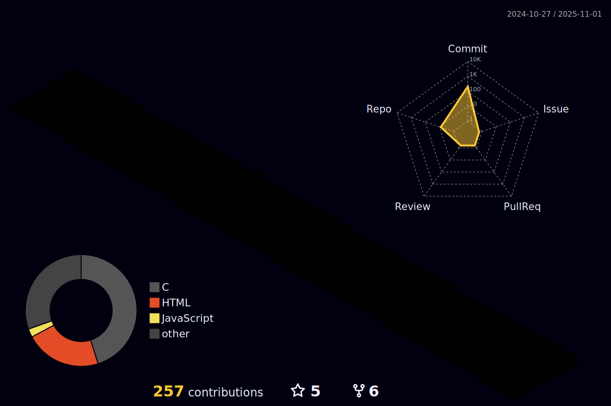

<h1 align="center">Hi 👋, I'm Charanjeet Singh Sidhu</h1>

  

---

 
   

 
   

 

---

- 🌱 I’m currently learning **Android and Flutter**  
- 👯 I’m looking to collaborate on **DevOps, Flutter & ML Projects**  
- 🤝 I’m looking for help with **AI Tools & ML Projects**  
- 💬 Ask me about **React, MERN, HTML, CSS, JavaScript, Data Structures etc.**  
- 📫 Reach me at **sidhucharan53@gmail.com**  
- 📅 Book a session with me → [Zcal Link](https://zcal.co/charansidhu)  
- ⚡ Fun fact → *I Think I am funny at Coding and Teaching Programming 😅*  

---

## 🌐 Connect with me  

---

## 🛠️ Languages & Tools  

 
  <!-- Icons remain same (already good) -->
  <!-- Example -->

                            

---

## 📊 GitHub Stats  

  

  

  

---

## 🌍 3D Contribution Graph

  

## 🐍 Snake Contributions

  <!-- 
   -->
<!--  -->
<!--  -->
  
  

----
## 💬 Random Dev Quote  

  

---

## 🎵 Spotify Now Playing  

  

---

## ☕ Support Me  

